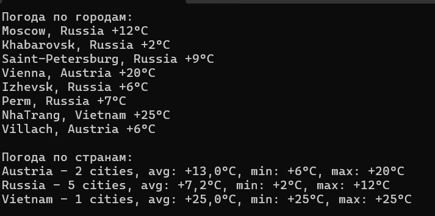

# vk2
Программа написана на языке C#. Она читает список городов из файла, получает для каждого актуальную погоду через API и выводит:

- текущую температуру по каждому городу;
- статистику по странам: среднюю, минимальную и максимальную температуру.

Для работы программы требуется .NET 8.0 (или новее) и соединение с интернетом.

Перед запуском проверьте путь к файлу с городами в Program.cs:

```csharp
string file = "vk-task-14.txt";
```
Результаты работы:


